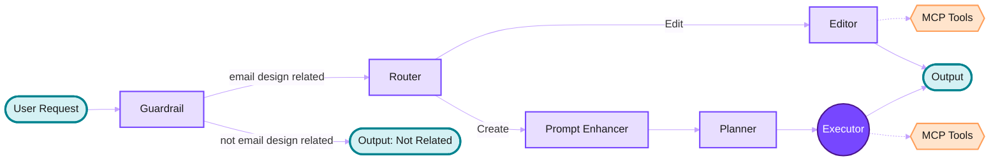

# Beefree AI Co-pilot

---

# Agenda

1. Agent vs Tools
2. Beefree AI Co-pilot Capabilities
3. Architecture
4. Why It's Hard
5. Live Demo
6. Lessons Learned
7. What's Next
8. Credits 
9. Q&A

---

# Agent vs Tools

- A **Tool** is like a specialized button, it does one specific thing when pressed. No thinking, no decisions.
- **MCP (Model Context Protocol)** is like a menu that shows the AI what buttons are available and what each one does.
- An **Agent** is like a smart assistant, you give it a goal, and it decides which buttons to press, in what order, to get the job done.

> "MCP provides the tools. The agent figures out how to use them."

---

# Beefree AI Co-pilot Capabilities

- **More advanced email creation** from natural language prompts
- **Basic email editing** of existing designs
- **V1**: more cycles ahead to improve quality, reliability, and capabilities

---
layout: default
---

# Architecture

---

# Our challenges

1. LLMs know **HTML, Python, React** and other common languages fluently. 
They've seen them millions of times. On the other hand it doesn't know **Beefree custom JSON format** or our specific **MCP toolset**.
2. **Tool calling reliability** — Agents don't always call the right tool at the right time.
3. **Prompt engineering** — Every line you add competes with every line already there. The real skill is **subtraction**.
4. **Evaluating correctness** — You can't unit test an agent. Knowing if it's doing a good job is non-trivial.

> "Beefree's JSON is harder to work with — but it's **why emails render correctly everywhere**."

---
layout: center
class: text-center
---

# Demo

---
layout: default
class: '!p-0 no-watermark'
---

  

    <iframe 
      src="https://beefree.io/app/index.html" 
      :style="{
        width: zoomedIframe === i ? '180%' : '200%',
        height: zoomedIframe === i ? '180%' : '200%',
        border: 'none',
        transform: zoomedIframe === i ? 'scale(0.56)' : 'scale(0.5)',
        transformOrigin: '0 0'
      }"
    ></iframe>
    <button
      @click="toggleZoom(i)"
      @mouseenter="hoveredButton = i"
      @mouseleave="hoveredButton = null"
      :style="{
        position: 'absolute',
        bottom: '5px',
        right: '5px',
        width: '20px',
        height: '20px',
        background: 'rgba(0, 0, 0, 0.7)',
        border: 'none',
        borderRadius: '4px',
        cursor: 'pointer',
        display: 'flex',
        alignItems: 'center',
        justifyContent: 'center',
        fontSize: '10px',
        color: 'white',
        transition: 'all 0.3s ease',
        zIndex: 1000,
        boxShadow: '0 2px 8px rgba(0,0,0,0.2)',
        opacity: hoveredButton === i ? '1' : '0.15'
      }"
      :title="zoomedIframe === i ? 'Exit fullscreen' : 'Fullscreen'"
    >
      {{ zoomedIframe === i ? '✕' : '⛶' }}
    </button>
  

---

# Lessons Learned

1. **JSON output schema is the key to good results.**  
   Garbage in, garbage out — a tight schema changes everything.

2. **Teach the LLM your mental model, not just your format.**  
   Our builder has no concept of a "body" — the LLM kept trying to create one. You have to rewire its assumptions.

3. **Less AI is sometimes the right call.**  
   The executor story. Deterministic beats autonomous when you need reliability.

4. **Prompt engineering is never done — and addition is the enemy.**  
   Every edge case someone wants to fix with a new line. Resist it.

---

# What's Next

We're still learning. Two directions we're actively exploring:

- **Fine-tuning on our toolset**  
  Instead of teaching the LLM our JSON through prompts, train it to speak our language natively.

- **Parallelizing the planner**  
  Split into an orchestrator + N parallel section planners. Faster, and better at complex multi-section emails.

> "The Beefree AI Co-pilot you saw today is v1. The interesting part is just starting."

---
layout: center
class: text-center
---

# Thanks for Listening!

Questions?

---

<!-- Write a travel inspiration email in Airbnb's style. Tone: warm, human, wanderlust-driven. Structure: full-bleed destination hero → friendly headline about belonging anywhere → two-sentence intro → three-column destination cards each with a photo, location name, and starting price → host spotlight split-screen with photo and short quote → CTA: 'Start Exploring.' Warm coral and white palette. -->

<!-- Write a premiere email for a new dark thriller series in Netflix's style. Tone: cinematic, mysterious. Structure: full-bleed key art hero with title treatment overlay → release date in red → two-line series logline → three-column episode preview strip with stills and one-line teasers → cast spotlight split-screen → CTA: 'Watch Now.' Black background, Netflix red accents only. -->

<!-- Write a feature announcement email in Spotify's style. Tone: friendly, energetic, slightly playful. Structure: colorful gradient hero with feature name large → two-sentence explanation of what's new → three-column icon triptych showing how it works step by step → animated GIF of the feature in the app → user testimonial pull quote → CTA: 'Try It Now.' Spotify green on dark background. -->

<!-- Write a launch email for a new iPhone in Apple's style. Tone: quiet confidence, zero hype. Structure: full-bleed product hero on white → five-word headline → two-sentence intro → alternating split-screen sections for three key features, each with a close-up shot and one paragraph → specs comparison table against previous model → primary CTA: 'Order Now'. Pure white background, SF Pro typography implied, single grey accent. -->